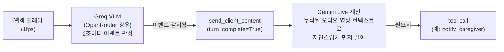

# 동행이 — 노인 돌봄 드론 에이전트 PoC

노인의 일상을 케어하는 에이전틱 드론이라는 아이디어([root_readme.md](root_readme.md))를,
실제 드론 하드웨어 없이 노트북 웹캠 + 실시간 멀티모달 LLM으로 흉내 낸 PoC.
구현체는 [`drone-agent-app/`](drone-agent-app/)에 있다.

## 핵심 아이디어: Passive API를 Proactive하게 만들기

이 프로젝트에서 가장 중요한 기술적 결정은 이거다 — **Gemini Live API는 기본적으로
반응형(passive)**이다. 마이크·카메라 데이터를 아무리 스트리밍해도, 사용자가 말을 걸거나
클라이언트가 명시적으로 신호를 주지 않으면 모델은 스스로 먼저 말하지 않는다.

그런데 root_readme.md의 시나리오들은 전부 **에이전트가 먼저 알아채고 먼저 말을 거는 것**이
핵심이다("낙상 감지했습니다!", "약 드실 시간이에요"). 이걸 만들기 위해 별도의 경량 감지
파이프라인이 Live API 세션에 **강제로 턴(turn)을 주입**하는 구조를 만들었다:



감지(무엇을 볼지)와 발화(어떻게 반응할지)를 의도적으로 분리했다 — 감지는 저렴하고 빠른
전용 VLM(Groq)이, 대화와 판단은 문맥을 유지하는 Gemini Live 세션이 담당한다.

## 3가지 시나리오

`drone-agent-app`은 이 메커니즘을 세 가지 실제 상황에 적용한다. 각각 독립된 페이지
(`/fall`, `/medication`, `/task`)이고, 우측 상단 탭으로 전환한다.

| 시나리오 | 트리거 | 반응 |
|---|---|---|
| **낙상 감지** (`/fall`) | 대화 중 카메라가 낙상 자세를 감지 | "괜찮으세요?"라고 먼저 물음 → 응답에 따라 `notify_caregiver` tool 호출(119 신고 알림) 또는 안심시키고 종료 |
| **약 복용 확인** (`/medication`) | 연결 직후, 저장된 처방 정보(`memory.json`) 기준으로 즉시 | "OO님, 20시입니다. 혈압약 드셔야 해요"라고 먼저 안내 → 복용 동작 감지되면 메모리에 기록하고 칭찬, 대시보드에 실시간 표시 |
| **작업 보조** (`/task`) | 사용자가 직접 질문 | 감지 로직 없이 카메라로 보이는 것에 대해 자연스럽게 답하는 단순 VLM 대화 |

세 시나리오는 하나의 공통 페르소나("동행이")를 공유한다 — 카메라로 보고 목소리로만
말할 수 있고, 팔다리가 없어 물건을 직접 다룰 수 없다는 제약도 명시돼 있다.

## 왜 Groq/OpenRouter를 같이 쓰는가

감지도 Gemini로 하면 될 것 같지만, 신규 프로젝트 + 프리뷰 모델 조합의 무료 한도가
하루 20회 수준으로 폴링에 못 쓸 정도였다. Groq(`llama-4-scout`)는 같은 용도로
무료 한도가 훨씬 여유롭지만(RPD 1,000 / RPM 30), 반복 테스트로 하루 토큰 한도(TPD)가
소진되는 문제와 Groq 자체의 수요 폭주로 인한 일시적 혼잡을 겪었다. 최종적으로는
**OpenRouter를 경유해 Groq를 우선 라우팅하되, 혼잡 시 자동으로 다른 제공자로 대체**되도록
설정해 속도와 안정성을 절충했다.

## 프로젝트 구조

```
life-knowledge/
├── root_readme.md              # 원본 기획 문서 (핵심 시나리오 정의)
├── README.md                   # 이 문서
└── drone-agent-app/            # 실제 구현체
    ├── main.py                 # FastAPI 앱 — 3개 라우트 + 3개 WebSocket 핸들러
    ├── gemini_live.py           # Gemini Live API 세션 래퍼 (강제 턴 발생 메커니즘 포함)
    ├── memory.py                 # 약 복용 시나리오용 JSON 메모리 저장소
    ├── static/
    │   ├── shared.css            # 3페이지 공통 디자인 시스템
    │   ├── gemini-client.js       # WebSocket 클라이언트 (페이지별 경로 설정 가능)
    │   ├── media-handler.js       # 마이크/카메라 캡처 (오디오 스트리밍 + 1fps 영상 캡처)
    │   └── fall.html / medication.html / task.html
    └── README.md                 # 시나리오별 요약 + 실행 방법
```

## 실행

```bash
cd drone-agent-app
pip install -r requirements.txt
cp .env.example .env   # GEMINI_API_KEY, OPEN_ROUTER_KEY 채우기
python main.py          # http://localhost:8003
```

마이크·카메라 권한은 브라우저 보안 정책상 HTTPS 또는 `localhost`에서만 허용된다 —
원격 서버에 배포할 경우 반드시 HTTPS(리버스 프록시 + 인증서)로 서빙해야 한다.

## 알려진 한계

- Groq 무료 티어의 TPD(하루 토큰) 한도는 반복 테스트로 쉽게 소진될 수 있음
- Gemini Live 세션은 최대 지속시간이 있어 오래 유휴 상태면 연결이 끊김(재연결 로직 미구현)
- 낙상/복용 감지는 정지 프레임 판정이라 "동작 자체"보다는 "그 순간의 자세"를 봄 —
  더 정교하게 만들려면 모션 감지로 이벤트 구간을 잡고 여러 프레임을 함께 판정하는
  방식(Lifenology에서 검증된 방식)으로 확장 가능
