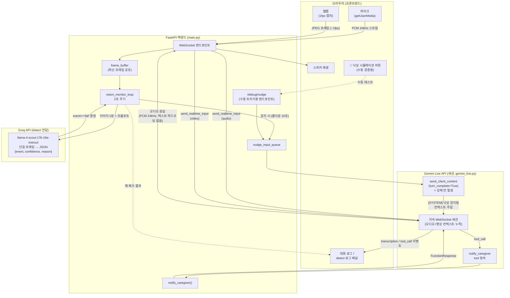

# 시나리오 A(긴급 상황) — 구현 현황

root_readme.md의 시나리오 A(낙상 감지 → "괜찮으세요?" → 119 신고 분기)를 검증하기 위해
만든 실시간 멀티모달 에이전트 PoC. Gemini Live API와 Groq VLM을 조합해서,
카메라가 낙상을 감지하면 대화 중이던 AI가 스스로 먼저 말을 걸도록 구현했다.

## 핵심 아이디어

Gemini Live API는 기본적으로 **반응형(passive)**이다. 사용자가 말을 걸거나 클라이언트가
명시적으로 신호를 주지 않으면, 비디오를 아무리 스트리밍해도 모델이 스스로 먼저 말하지 않는다.
그래서 "낙상을 알아서 감지하고 먼저 말 거는" 행동은 API가 기본 제공하지 않고, 직접 만들어야 했다.

해결 구조:

1. **감지(DETECT)**: Live 세션과 별개로, 최신 웹캠 프레임을 주기적으로 Groq VLM에 보내
   낙상 여부를 판정한다.
2. **주입(FEED)**: 감지되면 `send_client_content(turn_complete=True)`로 Gemini Live
   세션에 강제로 턴을 발생시켜, "방금 낙상이 감지됐다"는 컨텍스트를 주입한다.
3. **발화(SPEAK)**: Gemini Live가 (하드코딩된 대사 없이) 그 순간까지 쌓인 오디오/영상
   컨텍스트를 바탕으로 자연스럽게 "괜찮으세요?!"라고 스스로 발화한다.
4. **판단(BRANCH)**: 사용자 응답 내용을 듣고, 모델이 스스로 `notify_caregiver` tool을
   호출할지 판단한다 (root_readme.md의 3-1/3-2 분기에 대응).

## 왜 Gemini 단독이 아니라 Groq를 같이 쓰는가

처음엔 감지도 Gemini(`gemini-3-flash-preview`)로 하려 했으나, 이 모델의 무료 티어가
**하루 20회**로 극히 제한적이라(신규 프로젝트 + 프리뷰 모델 조합이 가장 인색한 등급)
초 단위 폴링이 불가능했다. Groq(`llama-4-scout-17b-16e-instruct`)는 같은 용도로
Lifenology(이전 작업물)에서 이미 검증된 모델이고 무료 한도도 훨씬 여유롭다
(RPD 1,000 / RPM 30 / TPM 30,000 / TPD 500,000).

**실측 결과**: 이 워크로드(풀 JPEG 프레임 포함, 요청당 ~2,500 토큰)에서 진짜 병목은
RPM이 아니라 **TPM/TPD**였다. 1초 폴링은 TPM을 30초 안에 소진, 2초 폴링이 데모 시연
길이(수십 초) 기준으로는 안정적인 절충점이었다. 하루 총 토큰(TPD)도 반복 테스트로
소진될 수 있음을 실측으로 확인함(500,000 중 대부분 소진 후 6~7분 간격 소량 회복).

## 아키텍처



## 데이터 흐름 요약 (텍스트)

```
[웹캠] --1초마다 프레임--> [frame_buffer] --2초마다--> [Groq VLM 판정]
                                                              |
                                                    event=="fall"?
                                                              | yes (쿨다운 통과 시)
                                                              v
                                                   [nudge_input_queue]
                                                              |
                                          send_client_content(turn_complete=True)
                                                              |
                                                              v
                                          [Gemini Live 세션 — 강제 턴 발생]
                                          누적된 오디오/영상 컨텍스트를 보고
                                          "괜찮으세요?!" 등을 스스로 생성
                                                              |
                                        사용자 응답 --------> 모델이 판단
                                                              |
                                            필요시 notify_caregiver tool 호출
```

## 구현된 파일

| 파일 | 역할 |
|---|---|
| `gemini-live-api-examples/gemini-live-genai-python-sdk/gemini_live.py` | `GeminiLive` 클래스. `send_nudge()` 태스크 추가 — `nudge_input_queue`를 소비해 `send_client_content(turn_complete=True)`로 강제 턴 발생. 시스템 프롬프트에 `[SYSTEM]` 메시지 해석 규칙과 tool 사용 지침 추가 |
| `gemini-live-api-examples/gemini-live-genai-python-sdk/main.py` | FastAPI 서버. `vision_monitor_loop`(Groq 낙상 감지, 2초 주기), `notify_caregiver` tool 정의/핸들러, `/debug/nudge`(수동 테스트용 엔드포인트), 매 detect 결과를 프론트로 브로드캐스트 |
| `gemini-live-api-examples/gemini-live-genai-python-sdk/frontend/` | `🚨 낙상 시뮬레이션` 버튼, 실시간 detect 로그 패널, `system_nudge`/`tool_call`/`detect_result` 메시지 렌더링 |
| `fall-detection-test/` | detect 단계만 떼어내 단독 검증하는 스탠드얼론 페이지 (Gemini → Groq 전환 검증에 사용) |

## 검증된 것

- 강제 턴 발생 → 프로액티브 발화까지 지연시간 약 1.7초
- 무응답 시 자동으로 `notify_caregiver` 호출 (3-1 분기)
- "괜찮아" 명확히 답하면 tool 미호출 (3-2 분기, 정성적으로 확인)
- 실제 낙상 동작(엎드림) → Groq 감지(confidence 0.8~0.9) → 자동 발화 → 응답 내용에 따른
  tool 호출까지 **버튼 개입 없이 완전 자동으로 반복 재현됨**

## 알려진 한계 / TODO

- Groq 무료 티어 TPD(하루 총 토큰) 소진 시 6~7분 간격으로만 소량 회복 — 반복 테스트 시 주의
- 2초 폴링도 "완전히 안전"하진 않음 — 장시간 지속 감시 시 결국 TPM/TPD에 걸릴 수 있음
  (진짜 안전한 지속 가능 주기는 약 5초)
- Gemini Live 세션 자체도 최대 지속시간 제한이 있어 장시간 유휴 시 GoAway로 종료됨 —
  재연결(session resumption handle 활용) 로직은 아직 미구현
- 시나리오 B(키오스크)는 별도 감지·선제개입 로직 없이 동일 에이전트로 음성+영상 대화만
  하는 것으로 범위 축소 결정 — 아직 미구현
- 시나리오 C(약 복용)는 미착수. A와 동일한 Groq 감지 파이프라인 재사용 가능할 것으로 예상
